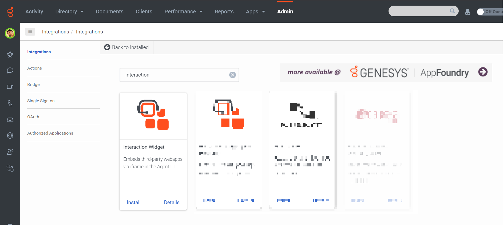
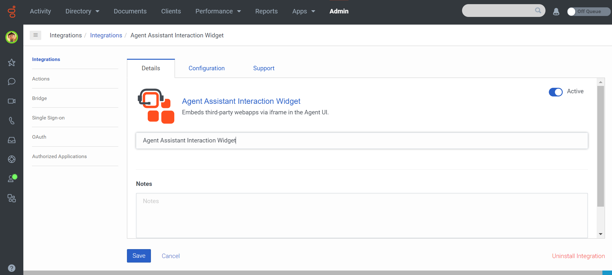
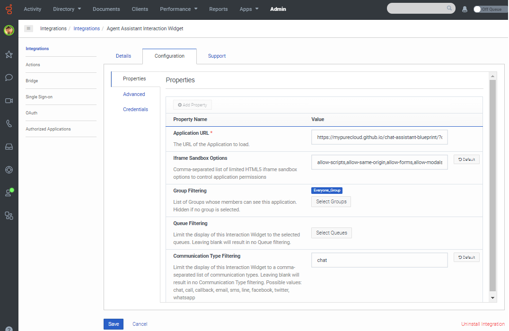

# Deployment Guide for Chat Assistant on Genesys Cloud
This Genesys Blueprint provides instructions for deploying a chat assistant on Genesys Cloud. The Chat Assistant actively listens to the chat interaction and suggest responses based on keywords. Sending messages and the typing indicator features of the Chat API will be convenient in this scenario.

Genesys Cloud uses the Interaction Widget to provide agents with a list of suggested response.


## Solution components
* **Genesys Cloud** - The Genesys cloud-based contact center platform. Genesys Cloud is the platform for the Chat Assistant solution.
* **Genesys AppFoundry** - The Genesys AppFoundry is an app marketplace for solutions that run on the Genesys Cloud platform. You get the Chat Assistant integration used in the solution from the Genesys AppFoundry.

### Software Development Kit (SDK)
* **Genesys Cloud Platfrom API SDK** - This SDK is used for the initial interaction of agent and customer over chat.

## Requirements

### Specialized knowledge
Implementing this solution requires experience in several areas or a willingness to learn:
* Administrator-level knowledge of Genesys Cloud and the Genesys AppFoundry
* Genesys Cloud Platform API knowledge

### Genesys Cloud account requirements
This solution requires a Genesys Cloud license. For more information on licensing, see [Genesys Cloud Pricing](https://www.genesys.com/pricing "Opens the pricing article").

A recommended Genesys Cloud role for the solutions engineer is Master Admin. For more information on Genesys Cloud roles and permissions, see the [Roles and permissions overview](https://help.mypurecloud.com/?p=24360 "Opens the Roles and permissions overview article").

## Deployment Steps

The Chat Assistant integration has the following stages:

- Download the repository containing the project files.
- Create a Token Implicit OAuth Grant for Genesys Cloud.
- Setup an Interaction Widget integration in Genesys Cloud.
- Create a Genesys web chat widget and test the Chat Assistant solution.

### Download the repository containing the project files

1. Go to the [repository](https://github.com/MyPureCloud/chat-assistant-blueprint) and clone it to your machine.

### Create a Token Implicit OAuth Grant for Genesys Cloud

1. Login to your Genesys Cloud organization and create a new OAuth API (Token Implicit Grant). [Create an OAuth Client](https://help.mypurecloud.com/articles/create-an-oauth-client/)
2. Assign your hosted site to the Authorized redirect URIs.
3. Modify [main.js](https://github.com/MyPureCloud/chat-assistant-blueprint/blob/master/docs/scripts/main.js) from the blueprint repository and enter the credentials for Genesys Cloud.

<div style="margin-left: 40px;">

:::primary
**Important**: By default, the integration works with Genesys Cloud environments located in Americas (US East): `mypurecloud.com`. If your Genesys Cloud organization is located in another region, then in the **Initial Setup** section of the `main.js` file, add `client.setEnvironment('{your Genesys Cloud environment}')`. For example, if your Genesys Cloud organization is located in Asia Pacific (Sydney), then add `client.setEnvironment('mypurecloud.com.au')`. For more information about the regions, see [Platform API](https://developer.mypurecloud.com/api/rest/ "Opens the Platform API page").
:::

</div>

### Setup an Interaction Widget integration in Genesys Cloud
1. Login to your Genesys Cloud organization and add a new **Integration**.
   
   
2. Install the **Interaction Widget**.
   
   
3. (Optional) Use the Name box to give the app a different name.
   
   
4. Click the **Configuration** tab. In the **Application URL** box, type the URL of the web application. Be sure to specify the full URL, including the https: at the beginning of the URL.
   
   Be sure to also add the URL parameter pcConversationId at the end of the URL. This ensures that the solution will pass the active conversation ID to the solution.

   <pre class="language-nohighlight"><code class="language-nohighlight">/?conversationid=&#123;&#123;pcConversationId&#125&#125;</code></pre>

   Select a group for filtering user acces to the widget.

   (Optional) Select specific queues for widget access.

   Select the ACD interaction types where you want the widget to be available for.

   
   
5. Go to **Advanced** Configuration and enter this in the text area
<div style="margin-left: 40px;">

 ```json
{
  "lifecycle": {
    "ephemeral": false,
    "hooks": {
      "stop": true,
      "blur": true,
      "focus": true,
      "bootstrap": true
    }
  },
  "monochromicIcon": {
    "vector": "https://raw.githubusercontent.com/MyPureCloud/chat-assistant-blueprint/master/blueprint/images/Chatbot.svg"
  }
}
```
</div>

6. **Save** and **Activate** the integration.

### Create a Genesys web chat widget and test the Chat Assistant solution
1. Create a Genesys web chat widget if you haven't already. [Create a widget for web chat](https://help.mypurecloud.com/?p=195772).
2. Go to Genesys Cloud [Developer Tools](https://developer.mypurecloud.com/developer-tools/#/webchat).
3. Select your deployment and queue and initiate a chat interaction.

Once the agent is offered/answers the incoming interaction, they should see the Agent Assistant panel in one of the Agent tools section.


Clicking it will open the Chat Assistant. The Chat Assistant will actively listen to keywords and display suggested response to the agent. Clicking a suggested response sends the text to the customer.


## Additional Resources
* [Genesys Cloud Developer Center](https://developer.mypurecloud.com/)
* [Genesys Cloud Platform Client SDK](https://developer.mypurecloud.com/api/rest/client-libraries/)
* [Chat Assistant Tutorial](https://developer.mypurecloud.com/api/tutorials/agent-chat-assistant/?language=javascript&step=1)
* [Chat Assistant Blog](https://developer.mypurecloud.com/blog/2020-02-19-agent-chat-assistant/)
